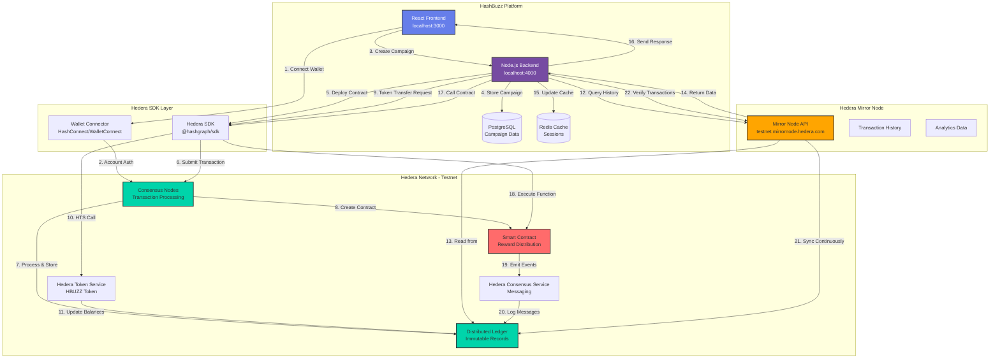
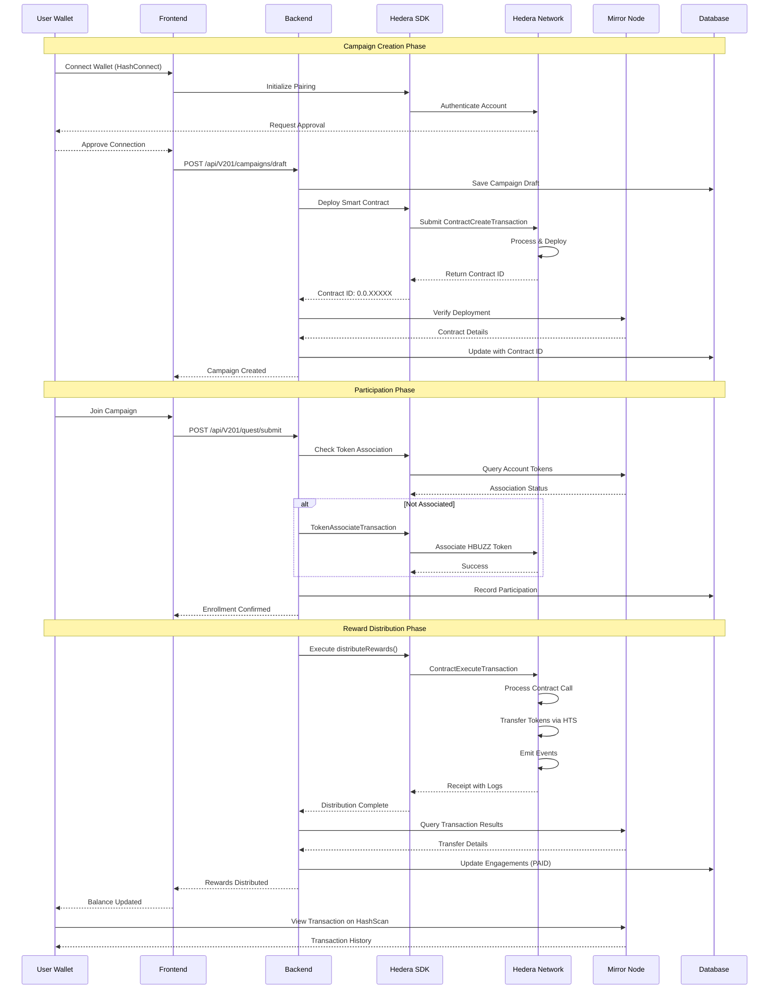

# ⛓️ Hedera ↔ HashBuzz Communication Architecture

Complete system integration and data flow between the HashBuzz platform and the Hedera Hashgraph network.

---

## 🔄 Complete Communication Flow

---

## 📡 Communication Layers Breakdown

### 🎨 Frontend Layer

- User wallet connection via HashConnect
- Campaign creation UI interactions
- Real-time balance updates
- Transaction status monitoring
- Smart contract read operations

### ⚙️ Backend API Layer

- Hedera SDK integration
- Smart contract deployment
- Token transfer orchestration
- Transaction signing & submission
- Mirror node queries

### 🔗 Hedera SDK Layer

- Account management
- Transaction building
- Smart contract calls
- Token operations (HTS)
- Network communication

### ⛓️ Hedera Network Layer

- Consensus node processing
- Smart contract execution
- Token service operations
- Distributed ledger updates
- Event emission (HCS)

---

## 🎯 Key Communication Scenarios

### 1️⃣ Campaign Creation & Smart Contract Deployment

- Frontend → Backend: User submits campaign details with reward amount and token ID
- Backend → Hedera SDK: Creates ContractCreateTransaction with campaign parameters
- SDK → Consensus Nodes: Submits signed transaction to network
- Consensus → Ledger: Processes transaction, deploys contract, assigns contract ID
- Ledger → Mirror Node: Syncs transaction record with metadata
- Backend → Mirror Node: Queries contract ID and confirms deployment
- Backend → Database: Stores campaign with contract ID reference

### 2️⃣ Token Association & Transfer

- Backend → SDK: Checks user token association status
- SDK → Mirror Node: Queries /api/v1/accounts/{accountId}/tokens
- Backend → SDK: Creates TokenAssociateTransaction if needed
- SDK → HTS: Associates token with user account
- Backend → SDK: Creates TransferTransaction for reward distribution
- SDK → HTS: Executes token transfer from treasury to user
- HTS → Ledger: Updates token balances on-chain

### 3️⃣ Smart Contract Reward Distribution

- Backend → SDK: Builds ContractExecuteTransaction for distributeRewards()
- SDK → Smart Contract: Calls contract function with participant list
- Smart Contract → HTS: Iterates through participants, transfers tokens
- Smart Contract → HCS: Emits RewardDistributed events
- Ledger → Mirror Node: Syncs contract execution results
- Backend → Mirror Node: Queries contract logs to verify distribution
- Backend → Database: Updates engagement records with transaction hashes

### 4️⃣ Transaction Verification & History

- Backend → Mirror Node: GET /api/v1/transactions/{transactionId}
- Mirror Node → Backend: Returns transaction details, status, and timestamp
- Backend → Mirror Node: GET /api/v1/contracts/{contractId}/results
- Mirror Node → Backend: Returns contract execution results and logs
- Backend → Frontend: Sends verified transaction data for UI display
- Frontend: Shows real-time transaction status with HashScan links

---

## 🛠️ Technical Implementation Details

### 📦 Backend Hedera Integration

- Hedera SDK: @hashgraph/sdk v2.x for all blockchain operations
- Client Setup: Client.forTestnet() with operator credentials
- Transaction Signing: PrivateKey.fromString() for operator signing
- Gas Management: Automatic gas estimation with 10% buffer
- Error Handling: Try-catch with transaction receipt validation

### 🔐 Authentication Flow

- HashConnect pairing with dApp
- User approves connection in wallet
- Backend receives accountId + signature
- JWT token issued for API access
- Session stored in Redis

### 💰 Token Operations

- TokenCreateTransaction for HBUZZ token
- TokenAssociateTransaction per user
- TransferTransaction for rewards
- TokenBurnTransaction for supply control
- Balance queries via Mirror Node

### 📜 Smart Contract Calls

- ContractExecuteTransaction for writes
- ContractCallQuery for reads
- Gas limit set to 2,000,000
- Payable amount for token transfers
- Event logs parsed from results

### 🔍 Mirror Node Queries

- REST API at testnet.mirrornode.hedera.com
- Transaction lookup by ID or timestamp
- Account balance history tracking
- Contract execution result retrieval
- Token transfer history

---

## 📊 Complete Campaign Lifecycle Data Flow

---

## 🌐 Key API Communication Endpoints

### Backend → Hedera Network (via SDK)

- Transaction Submission: All transactions go through consensus nodes
- Network: testnet.hedera.com (nodes 0.testnet.hedera.com to 5.testnet.hedera.com)
- Port: 50211 (gRPC)
- Protocol: gRPC with protobuf serialization

### Backend → Mirror Node (REST API)

- Base URL: https://testnet.mirrornode.hedera.com/api/v1/
- Transactions: GET /transactions/{transactionId}
- Accounts: GET /accounts/{accountId}
- Tokens: GET /tokens/{tokenId}
- Contracts: GET /contracts/{contractId}/results
- Balances: GET /balances?account.id={accountId}

### Frontend → Backend (REST API)

- Base URL: http://localhost:4000/api/
- Campaigns: POST /V201/campaigns/draft, GET /V201/campaigns/all
- Quests: POST /V201/quest/submit, GET /V201/quest/all
- Balance: GET /V201/balance/user/{accountId}
- Transactions: GET /V201/transactions/history

---

## ⚡ Performance Optimization Strategies

### 🚀 Caching Strategy

- Redis caches Mirror Node responses (5 min TTL)
- Token balance caching per user
- Smart contract state caching
- Transaction receipt caching
- Cache invalidation on state changes

### 🔄 Batch Processing

- Group multiple token transfers
- Batch Mirror Node queries
- Queue system for async operations
- Scheduled jobs for heavy tasks
- Event-driven architecture

### 📊 Monitoring & Logging

- Transaction ID logging per operation
- Gas usage tracking
- API response time metrics
- Error rate monitoring
- Network status checks

### 🛡️ Error Handling

- Retry logic for network failures
- Transaction receipt validation
- Fallback to Mirror Node queries
- Graceful degradation
- User-friendly error messages

---

## 🎯 Key Communication Principles

- Separation of Concerns: Frontend handles UI, Backend manages business logic, Hedera ensures consensus
- Asynchronous Processing: All blockchain operations are async with callbacks
- Dual Verification: Transactions verified both via SDK receipts and Mirror Node queries
- Immutable Records: All critical data stored on-chain for auditability
- Scalable Architecture: Redis queues and background workers handle high load
- Security First: Private keys never exposed to frontend, all signing server-side

---