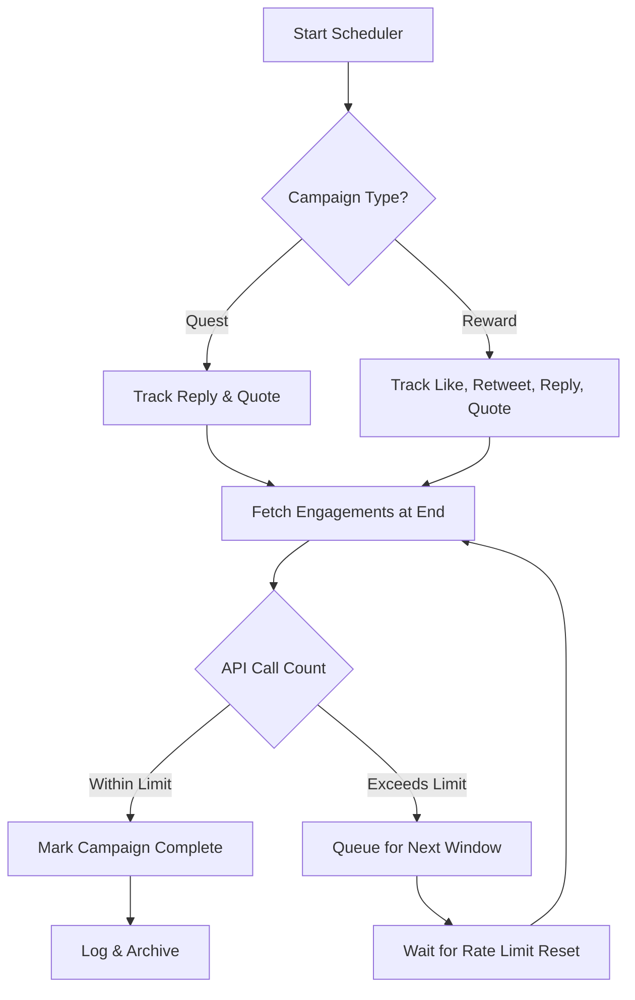

# Campaign Rate Limit Optimization (X API Basic Tier)

## Overview
This document analyzes X API Basic rate limits and calculates the maximum number of Quest and Reward campaigns that can be run per day, with a graphical flowchart and stepwise notes.

---

## X API Basic Tier Rate Limits (as of 2025)
- **Engagement endpoints**: 180 requests per 15 minutes (per app)
- **User/Tweet lookup**: 300 requests per 15 minutes
- **Max results per call**: 100 items
- **Auth**: App-only

---

## Campaign Types
- **Quest Campaign**: 15 minutes duration, only *reply* and *quote* data needed
- **Reward Campaign**: 60 minutes duration, all four engagement types (*like*, *retweet*, *reply*, *quote*) needed

---

## Calculation Assumptions
- Each campaign has one tweet to track
- Engagements fetched once at campaign end
- Each engagement type fetch = 1 API call (if <100 results)
- No overlap in campaigns
- Rate limit resets every 15 minutes

---

## Stepwise Calculation

### 1. Quest Campaigns
- **Engagements needed**: reply + quote = 2 API calls per campaign
- **Duration**: 15 minutes
- **Max campaigns per 15 min window**: 180 / 2 = **90**
- **Max campaigns per day**: 90 × (24 × 4) = **8,640**

### 2. Reward Campaigns
- **Engagements needed**: like + retweet + reply + quote = 4 API calls per campaign
- **Duration**: 60 minutes
- **Max campaigns per 15 min window**: 180 / 4 = **45**
- **Max campaigns per day**: 45 × (24 × 4) = **4,320**

### 3. Mixed Campaigns
- If running both types, total API calls per 15 min window must not exceed 180.
- Example: 60 Quest + 15 Reward = (60×2) + (15×4) = 120 + 60 = 180 calls (window max)

---

## Flowchart: Campaign API Usage & Scheduling

---

## Notes on Each Step
- **Start Scheduler**: System begins campaign tracking and schedules jobs.
- **Campaign Type?**: Determines which engagement types to fetch.
- **Track Engagements**: Only required types are tracked per campaign.
- **Fetch Engagements**: At campaign end, system fetches engagement data.
- **API Call Count**: Calculates total API calls for current window.
- **Within Limit**: If under 180 calls/15min, process campaigns immediately.
- **Exceeds Limit**: If over, queue campaigns for next window.
- **Log & Archive**: Mark campaign as complete and store results.
- **Wait for Rate Limit Reset**: Scheduler waits for next window before retrying queued jobs.

---

## Recommendations
- **Quest Campaigns**: Up to 8,640 per day (if only these run)
- **Reward Campaigns**: Up to 4,320 per day (if only these run)
- **Mixed**: Use batching and queueing to stay under 180 calls/15min
- **Always monitor rate limit headers and adjust dynamically**

---

## References
- [X API Rate Limits](https://docs.x.com/x-api/fundamentals/rate-limits)
