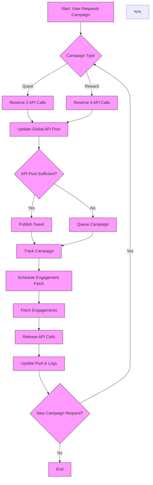

# System-Level Rate Limit Management for X API Campaigns

## Overview
This document presents a system-level architecture for managing X API Basic rate limits when multiple users create Quest and Reward campaigns. It includes a mermaid flowchart with notes and logic for dynamic allocation, tracking, and enforcement.

---

## Key Concepts
- **Global API Call Pool**: Shared quota (180 calls/15min) for all users/campaigns
- **Dynamic Allocation**: As users create campaigns, available slots for each type adjust in real time
- **Campaign Types**:
  - Quest: 2 calls/campaign (reply, quote)
  - Reward: 4 calls/campaign (like, retweet, reply, quote)
- **Scheduler/Manager**: Tracks active campaigns, allocates API calls, queues jobs, and enforces limits

---

## System Flowchart

---

## Dynamic Calculation Logic

- **Global API Pool**: 180 calls/15min
- **On Each New Campaign Request**:
  - If Quest: decrement pool by 2
  - If Reward: decrement pool by 4
  - If pool < required, queue campaign
- **Real-Time Adjustment**:
  - As campaigns complete and calls are released, queued campaigns are published
  - If users create only Quest campaigns, max possible Reward campaigns decreases (and vice versa)
- **Example**:
  - If 80 Quest campaigns (80×2=160 calls) are active, only 5 Reward campaigns (5×4=20 calls) can be started in same window (160+20=180)
  - If 45 Reward campaigns (45×4=180 calls) are active, no Quest campaigns can be started until pool resets

---

## Notes on Flowchart Steps
- **A**: Entry point for campaign creation requests
- **B**: System checks type to determine API call cost
- **C/D**: Reserves API calls from global pool
- **E**: Updates pool, tracks available calls
- **F**: If pool sufficient, campaign is published; else, queued
- **G/H**: Campaign is either started or queued for next window
- **I**: Active campaigns tracked for engagement fetch scheduling
- **J**: Engagement fetch scheduled at campaign end
- **K**: Engagement data fetched using reserved calls
- **L**: API calls released back to pool
- **M**: Pool and logs updated; system ready for next request
- **N**: Loop for continuous campaign creation
- **O**: End of process

---

## Recommendations
- **Implement global API pool manager** (Redis or in-memory)
- **Enforce dynamic allocation and queuing**
- **Log pool state and campaign actions for audit**
- **Monitor rate limit headers and auto-adjust pool**
- **Provide user feedback if campaign is queued due to limits**

---

## References
- [X API Rate Limits](https://docs.x.com/x-api/fundamentals/rate-limits)
