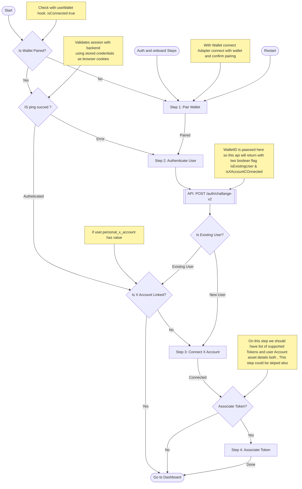
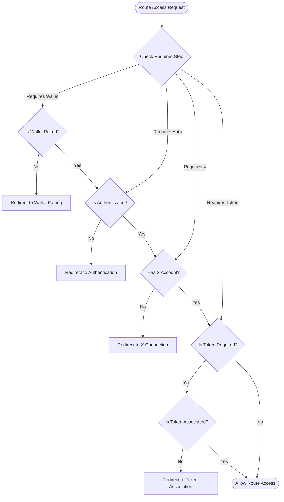
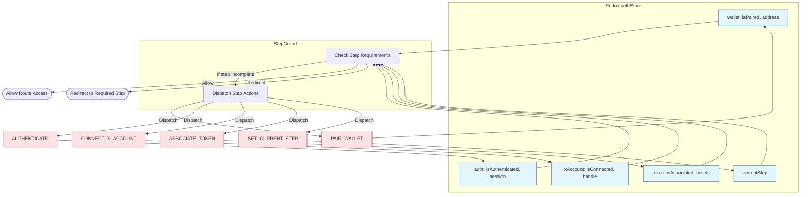

# Authentication and user onboard Flow

Below is an enhanced authentication flow for new and returning users. Step names are meaningful and readable.

### Overview

The authentication and onboarding process is designed to handle both new and returning users, ensuring a smooth and secure experience. The flow consists of several key steps, each with clear responsibilities and transitions:

1. **Wallet Pairing**: The user connects their crypto wallet to the application.
2. **Authentication**: The application verifies the user's identity using the paired wallet.
3. **X Account Connection**: The user links their X (formerly Twitter) account for social features.
4. **Token Association**: The user associates supported tokens with their account (optional, depending on route requirements).

### Detailed Steps

#### 1. Wallet Pairing

- **Purpose**: Establish a secure connection between the user's wallet and the app.
- **How**: The app uses a wallet connect adapter to prompt the user to pair their wallet.
- **Outcome**: On success, the wallet address is stored in the app state.

#### 2. Authentication

- **Purpose**: Authenticate the user using their paired wallet.
- **How**: The app sends a challenge request to the backend (`POST /auth/challange-v2`), passing the wallet ID.
- **Backend Response**: Indicates if the user is new or returning, and whether their X account is already linked.
- **Outcome**: The app updates authentication state and determines the next step.

#### 3. X Account Connection

- **Purpose**: Link the user's X account for social features and verification.
- **How**: If not already connected, the user is prompted to authorize and connect their X account.
- **Outcome**: On success, the X account handle is stored in the app state.

#### 4. Token Association (Optional)

- **Purpose**: Allow users to associate supported tokens with their account for token-gated features.
- **How**: The app displays available tokens and the user's asset details. The user can choose to associate tokens or skip this step.
- **Outcome**: Associated tokens are recorded in the app state.

### Flow for Returning Users

- If the wallet is already paired, the app pings the backend to validate the session using stored credentials (e.g., browser cookies).
- If authenticated, the app checks if the X account is linked.
- If all required steps are complete, the user is directed to the dashboard.
- If any step is incomplete, the user is redirected to the appropriate onboarding step.

### Flow for New Users

- The user is guided through wallet pairing, authentication, X account connection, and (optionally) token association.
- Each step must be completed before proceeding to the next.
- Upon completion, the user is granted access to the dashboard.

### Notes

- The flow is managed by the `StepGuard` component, which ensures users complete all required steps before accessing protected routes.
- Redux `authStore` tracks the state of each step, enabling seamless navigation and state management.
- Actions such as `PAIR_WALLET`, `AUTHENTICATE`, `CONNECT_X_ACCOUNT`, and `ASSOCIATE_TOKEN` update the store and trigger step transitions.

This structured approach ensures both security and a user-friendly onboarding experience, with clear checkpoints and state management throughout the authentication process.

### User Onboard Steps flow

## StepGuard Component Flow

The `StepGuard` component ensures proper route access based on authentication state and required step completion.

Each step in the guard ensures:

1. Wallet pairing is complete when required
2. Authentication is valid when needed
3. X Account connection is verified for social features
4. Token association is checked for token-gated routes

## Redux `authStore` Mapping and Step Control Flow

Below is a diagram showing how the Redux `authStore` maps to authentication steps and the actions required for step transitions, as coordinated by the `StepGuard` component.

**Key Points:**

- `authStore` holds state for each step: wallet, authentication, X account, token, and current step.
- `StepGuard` reads from `authStore` to determine if the user can proceed or needs to be redirected.
- Actions (`PAIR_WALLET`, `AUTHENTICATE`, etc.) update the store and control step transitions.
- `SET_CURRENT_STEP` tracks the user's progress for navigation and guard logic.
