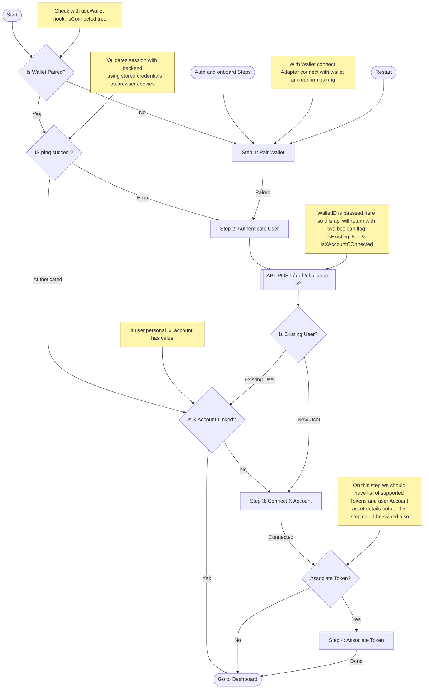
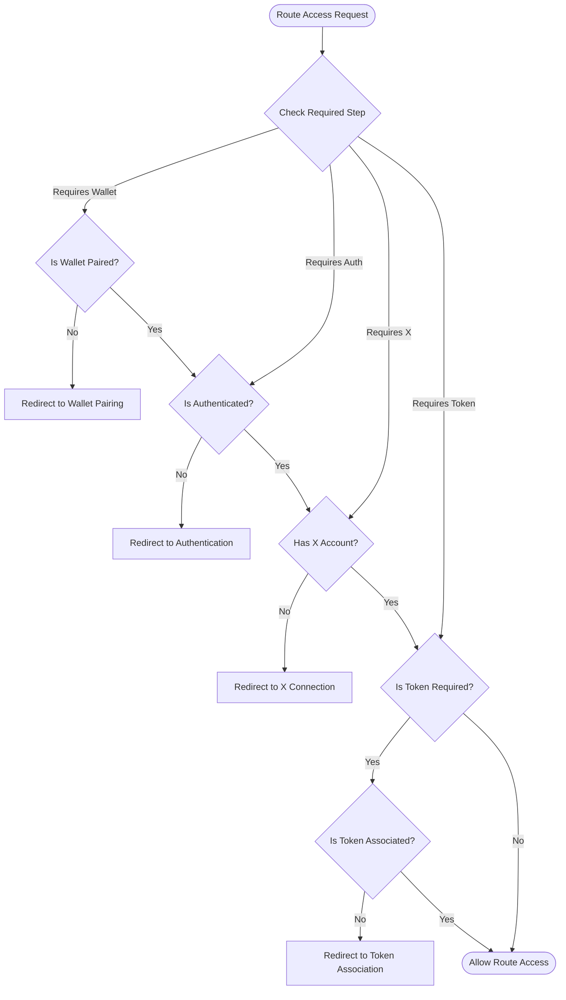
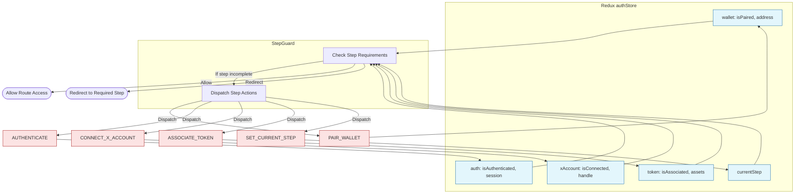

# Authentication Flow

Below is an enhanced authentication flow for new and returning users. Step names are meaningful and readable.

## StepGuard Component Flow

The `StepGuard` component ensures proper route access based on authentication state and required step completion.

Each step in the guard ensures:

1. Wallet pairing is complete when required
2. Authentication is valid when needed
3. X Account connection is verified for social features
4. Token association is checked for token-gated routes

## Redux `authStore` Mapping and Step Control Flow

Below is a diagram showing how the Redux `authStore` maps to authentication steps and the actions required for step transitions, as coordinated by the `StepGuard` component.

**Key Points:**
- `authStore` holds state for each step: wallet, authentication, X account, token, and current step.
- `StepGuard` reads from `authStore` to determine if the user can proceed or needs to be redirected.
- Actions (`PAIR_WALLET`, `AUTHENTICATE`, etc.) update the store and control step transitions.
- `SET_CURRENT_STEP` tracks the user's progress for navigation and guard logic.
