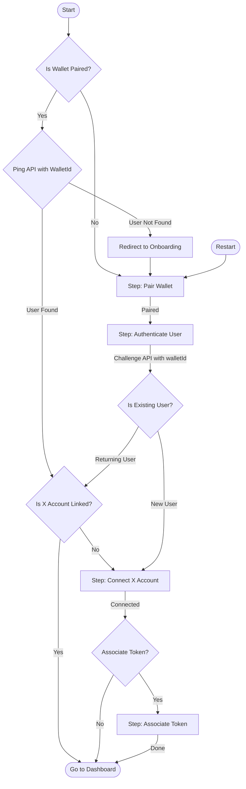
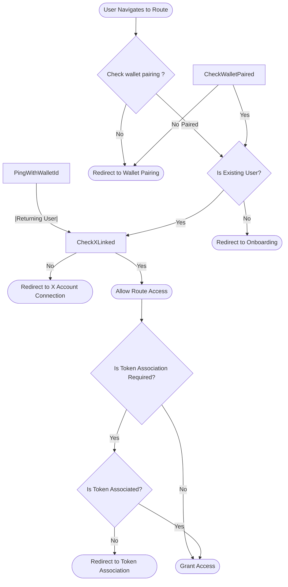

# Authentication Flow

Below is an enhanced authentication flow for new and returning users. Step names are meaningful and readable.

## StepGuard Component Flow

The `StepGuard` component ensures users can only access routes appropriate to their authentication state, as tracked in the auth store.

