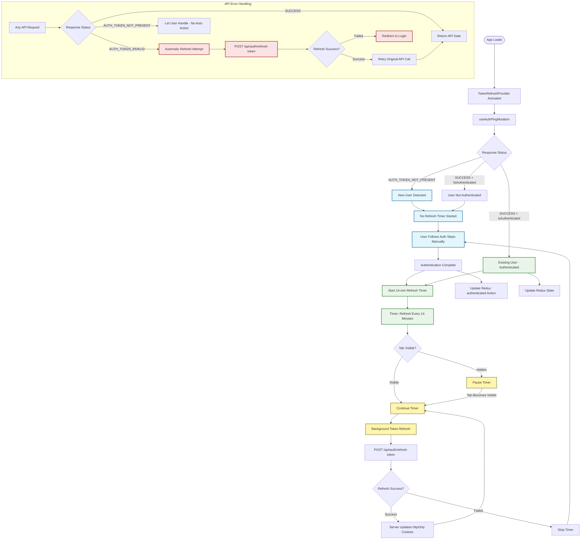

# Token Refresh Integration

## Quick Setup

Your automatic token refresh is already integrated! Here's what's happening:

## 📊 Complete Flow Diagram



### 🎯 New User Flow
1. **First visit** → `useAuthPingMutation` returns `AUTH_TOKEN_NOT_PRESENT`
2. **User follows auth steps manually** → No automatic redirects
3. **After successful auth** → Token refresh timer starts automatically

### 🔄 Existing User Flow  
1. **App loads** → Session validation via `useAuthPingMutation`
2. **If authenticated** → Token refresh timer starts
3. **Every 14 minutes** → Automatic background refresh
4. **On auth errors** → Auto-refresh and retry (except for new users)

### ✅ What's Already Done
- `TokenRefreshProvider` handles initial session check and token refresh
- `apiBase.ts` distinguishes between new users (`AUTH_TOKEN_NOT_PRESENT`) and expired tokens (`AUTH_TOKEN_INVALID`)
- New users can follow auth steps without automatic interference
- Existing users get seamless background refresh

### 🚀 Usage
The `TokenRefreshProvider` is already wrapping your app in `AppRouter.tsx`. No additional setup needed!

## Error Handling Logic

```typescript
// New user (no token) - let them auth manually
AUTH_TOKEN_NOT_PRESENT → No auto-redirect, component handles error

// Existing user (expired token) - auto-refresh
AUTH_TOKEN_INVALID → Automatic refresh + retry request
```

## 🔄 StepGuard Integration Flow

```mermaid
flowchart TD
    UserVisit([User Visits Auth Route]) --> StepGuard[StepGuard Component]
    StepGuard --> CheckRedux{Check Redux Auth State}
    
    %% Redux State Checks
    CheckRedux --> WalletCheck{wallet.isPaired?}
    CheckRedux --> AuthCheck{auth.isAuthenticated?}
    CheckRedux --> XAccountCheck{xAccount.isConnected?}
    CheckRedux --> TokenCheck{token.isAllAssociated?}
    
    %% Step Decision Logic
    WalletCheck -->|No| RedirectWallet[Redirect to /auth/pair-wallet]
    WalletCheck -->|Yes| AuthCheck
    AuthCheck -->|No| RedirectAuth[Redirect to /auth/sign-authentication]
    AuthCheck -->|Yes| XAccountCheck
    XAccountCheck -->|No| RedirectX[Redirect to /auth/connect-x-account]
    XAccountCheck -->|Yes| TokenCheck
    TokenCheck -->|No| RedirectToken[Redirect to /auth/associate-tokens]
    TokenCheck -->|Yes| RedirectDashboard[Redirect to /dashboard]
    
    %% Token Refresh Impact
    subgraph Token Refresh Impact
        TokenExpiry[Access Token Expires] --> APIFail[API Call Fails: AUTH_TOKEN_INVALID]
        APIFail --> AutoRefreshAPI[Auto Refresh Token]
        AutoRefreshAPI --> RefreshSuccess{Refresh Success?}
        RefreshSuccess -->|Yes| UpdateReduxAuth[Redux: auth.isAuthenticated = true]
        RefreshSuccess -->|No| UpdateReduxUnauth[Redux: auth.isAuthenticated = false]
        UpdateReduxAuth --> StepGuardReact[StepGuard Reacts to State Change]
        UpdateReduxUnauth --> StepGuardReact
        StepGuardReact --> CheckRedux
    end
    
    %% Component Rendering
    RedirectWallet --> RenderWallet[Render Pair Wallet Page]
    RedirectAuth --> RenderAuth[Render Sign Auth Page]
    RedirectX --> RenderX[Render Connect X Page]
    RedirectToken --> RenderToken[Render Associate Tokens Page]
    RedirectDashboard --> RenderDashboard[Render Dashboard]
    
    %% New User Journey with Token Refresh
    subgraph New User Complete Journey
        NewUserStart[New User Visits Any Auth Route] --> SGCheck[StepGuard: Check States]
        SGCheck --> AllIncomplete[All States: false]
        AllIncomplete --> ToWallet[Redirect to Pair Wallet]
        ToWallet --> WalletPair[User Pairs Wallet]
        WalletPair --> DispatchWallet[Dispatch: walletPaired]
        DispatchWallet --> SGRecheck1[StepGuard: Recheck States]
        SGRecheck1 --> ToAuth[Auto-redirect to Sign Auth]
        ToAuth --> UserAuth[User Authenticates]
        UserAuth --> DispatchAuth[Dispatch: authenticated]
        DispatchAuth --> StartRefreshTimer[TokenRefreshProvider: Start Timer]
        StartRefreshTimer --> SGRecheck2[StepGuard: Recheck States]
        SGRecheck2 --> ToX[Auto-redirect to Connect X]
        ToX --> ConnectX[User Connects X Account]
        ConnectX --> DispatchX[Dispatch: connectXAccount]
        DispatchX --> SGRecheck3[StepGuard: Recheck States]
        SGRecheck3 --> ToTokens[Auto-redirect to Associate Tokens]
        ToTokens --> AssocTokens[User Associates Tokens]
        AssocTokens --> DispatchTokens[Dispatch: associateTokens]
        DispatchTokens --> SGRecheck4[StepGuard: Recheck States]
        SGRecheck4 --> ToDashboard[Auto-redirect to Dashboard]
    end
    
    %% Styling
    classDef stepguard fill:#f0e6ff,stroke:#7c3aed,stroke-width:2px
    classDef redirect fill:#fef3c7,stroke:#d97706,stroke-width:2px
    classDef refresh fill:#dcfce7,stroke:#16a34a,stroke-width:2px
    classDef journey fill:#dbeafe,stroke:#2563eb,stroke-width:2px
    
    class StepGuard,CheckRedux,SGCheck stepguard
    class RedirectWallet,RedirectAuth,RedirectX,RedirectToken,RedirectDashboard redirect
    class TokenExpiry,AutoRefreshAPI,StartRefreshTimer refresh
    class NewUserStart,WalletPair,UserAuth,ConnectX,AssocTokens journey
```



## Error Handling Logic

```typescript
// New user (no token) - let them auth manually
AUTH_TOKEN_NOT_PRESENT → No auto-redirect, component handles error

// Existing user (expired token) - auto-refresh
AUTH_TOKEN_INVALID → Automatic refresh + retry request
```

That's it! Your app now handles both new users and token refresh seamlessly.
