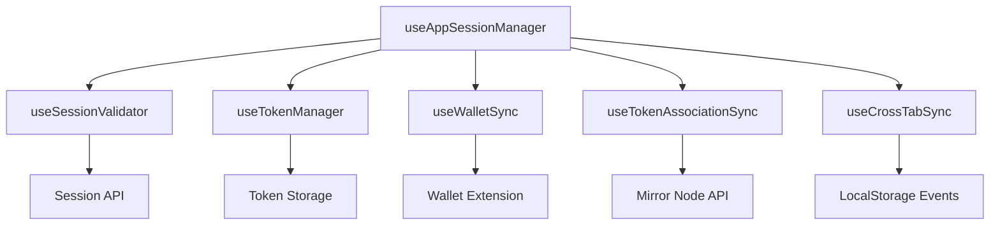
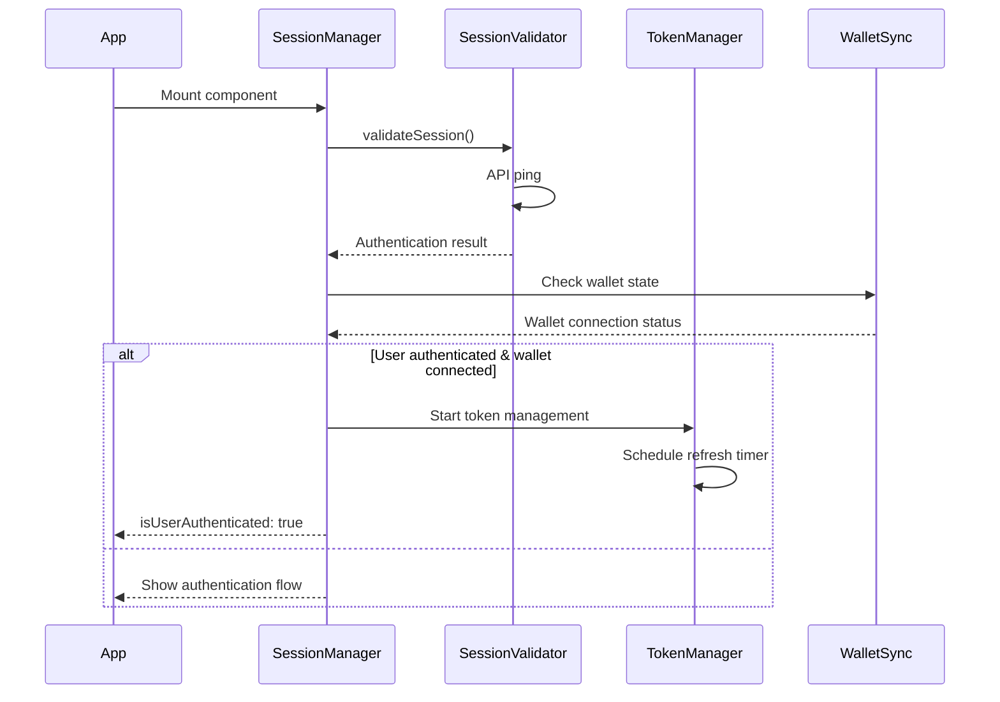

# Session Manager Hook - Design Documentation

## Architecture Overview

The session manager is designed as a modular hook system that handles user authentication, wallet connections, and token management. Each module operates independently while communicating through a central orchestrator.



## Module Responsibilities

### useSessionValidator
- Validates session on mount via API ping
- Sets authentication state based on response
- Handles rate limiting and error states
- Manages initialization flags (`hasInitialized`, `isInitializing`)

### useTokenManager  
- Stores and retrieves token expiry timestamps
- Schedules automatic token refresh before expiry
- Handles refresh API calls with cross-tab locking
- Manages refresh timers and background operations

### useWalletSync
- Monitors wallet extension connection state
- Dispatches wallet pairing actions to Redux
- Throttles rapid state changes to prevent loops
- Handles wallet disconnection cleanup

### useTokenAssociationSync
- Fetches contract and user token lists
- Compares and syncs token associations
- Updates Redux state with token data
- Runs only when user is fully authenticated

### useCrossTabSync
- Listens for localStorage events between tabs
- Synchronizes token refresh operations
- Prevents duplicate refresh calls
- Updates timers when other tabs refresh tokens

## Key Design Patterns

### State Management
The hook uses a combination of:
- **useState** for component-level state (initialization flags)
- **useRef** for persistent values that don't trigger re-renders
- **Redux selectors** for global authentication state
- **localStorage** for cross-tab communication

### Effect Dependencies
Effects are carefully designed to prevent infinite loops:
- Session validation runs only once on mount (empty dependency array)
- Token operations depend only on authentication state changes
- Wallet sync uses refs to track previous state

### Error Handling
All modules implement consistent error handling:
- Network errors are logged but don't break the flow
- Authentication errors clear session data
- Rate limiting triggers retry logic
- Invalid data is cleared and reinitialized

## Data Flow



## Configuration Points

The hook accepts configuration to adapt to different environments:

```typescript
interface UseAppSessionManagerProps {
  refreshEndpoint?: string;     // Token refresh API endpoint
  bufferSeconds?: number;       // Refresh buffer before expiry
  sessionExpireMinutes?: number; // Default session duration
}
```

## Extension Points

### Adding New Modules
New functionality can be added by:
1. Creating a new hook in `session-manager/` folder
2. Following the established pattern (useCallback for functions, consistent error handling)
3. Importing and initializing in the main hook
4. Adding required dependencies to the return object

### Modifying Token Logic
Token management can be customized by:
- Adjusting buffer time for different security requirements
- Changing refresh endpoints for different environments
- Modifying expiry validation logic
- Adding additional token validation steps

### Custom State Handling
Additional state can be managed by:
- Adding new flags to the return object
- Creating computed states based on existing flags
- Implementing custom loading states for specific UI needs

## Testing Considerations

Each module can be tested independently:
- **useSessionValidator**: Mock API responses for different scenarios
- **useTokenManager**: Test timer scheduling and refresh logic
- **useWalletSync**: Simulate wallet connection/disconnection
- **useTokenAssociationSync**: Mock token API responses
- **useCrossTabSync**: Test localStorage events

## Performance Optimizations

The hook implements several performance patterns:
- **Throttling**: Wallet state changes are throttled to prevent rapid updates
- **Tab Visibility**: Token operations pause when tab is hidden
- **Cross-tab Coordination**: Only one tab performs token refresh at a time
- **Minimal Re-renders**: Uses refs for values that don't need to trigger updates

## Future Modifications

When modifying the hook, consider:
- **Backward Compatibility**: New features should not break existing API
- **Error Boundaries**: Add error handling for new operations
- **Logging**: Use the established logging utilities for consistency
- **State Persistence**: Consider which state needs to survive page refreshes
- **Cross-tab Impact**: Ensure new features work correctly across multiple tabs