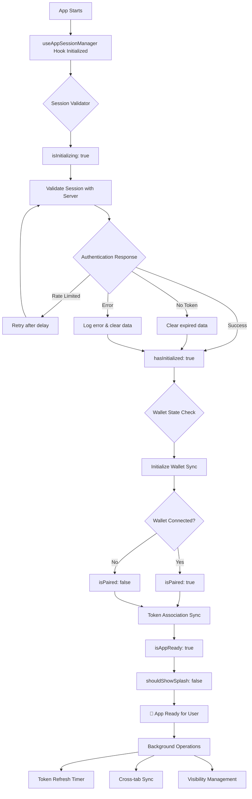
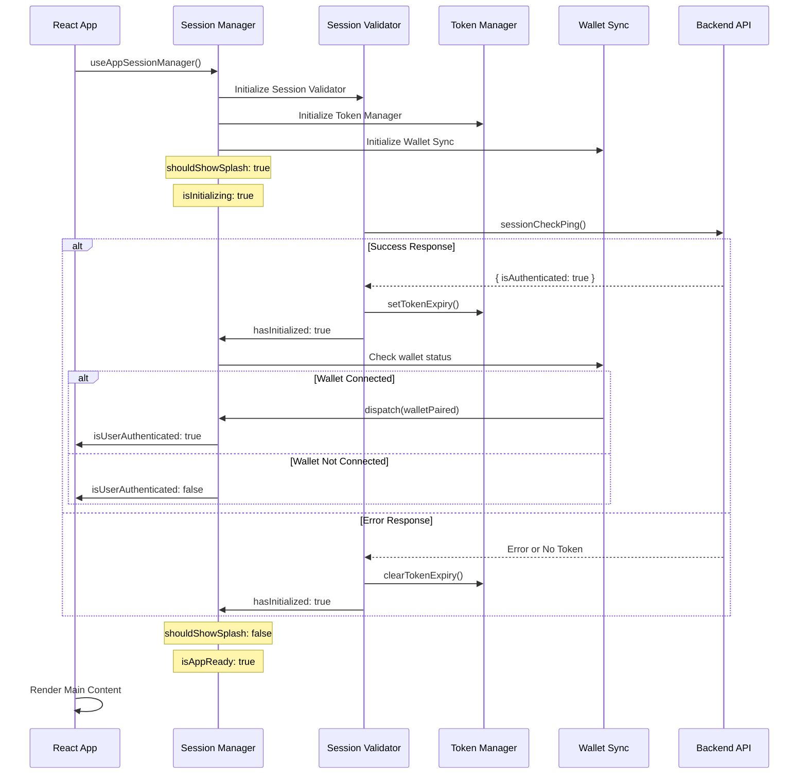
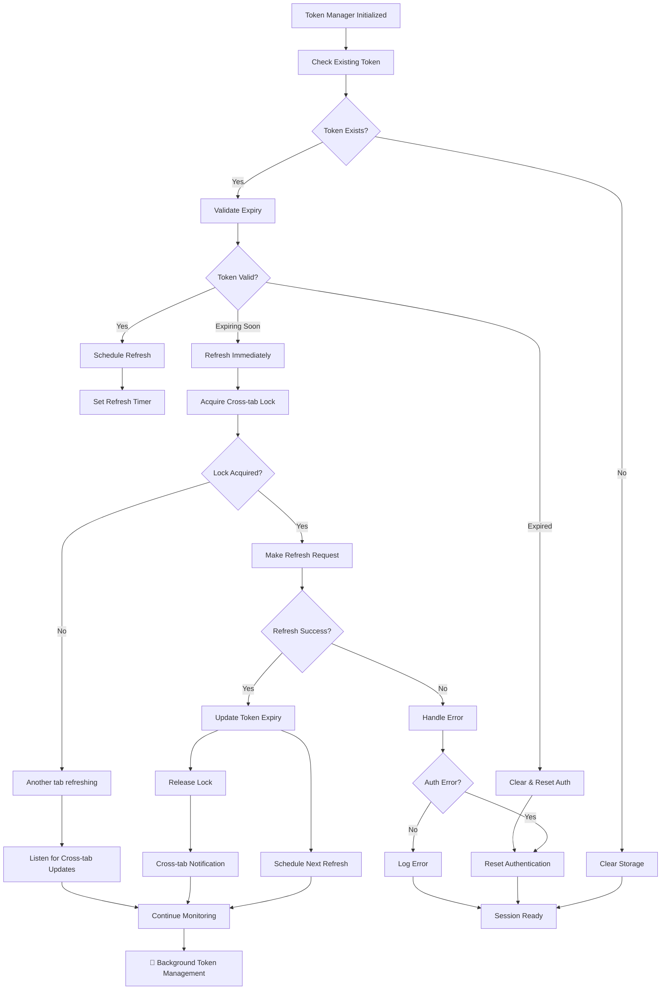
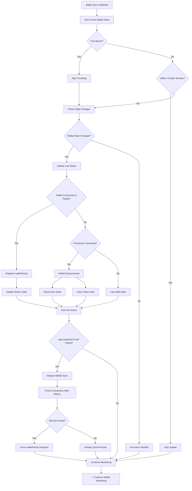
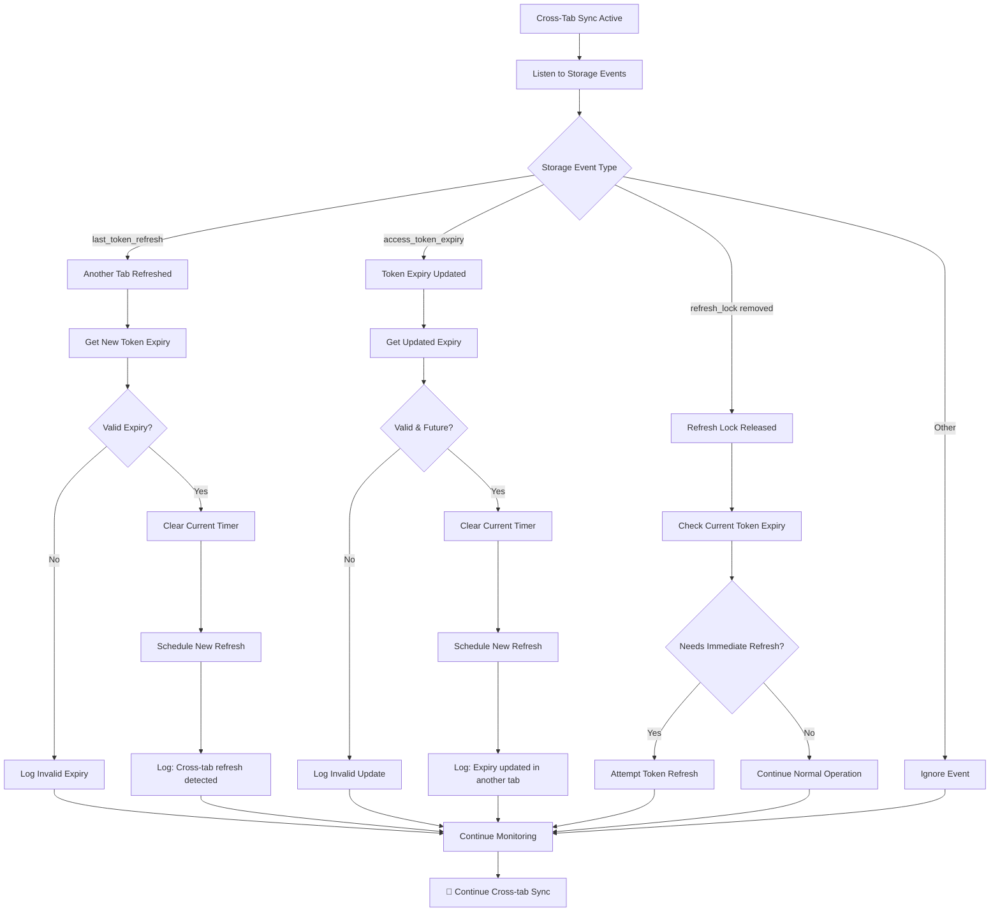
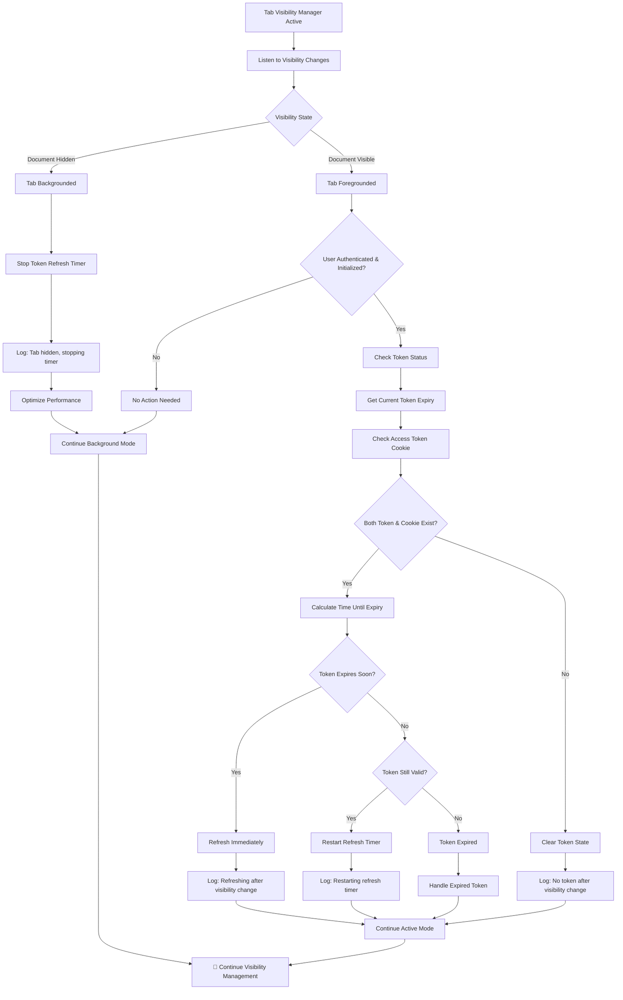
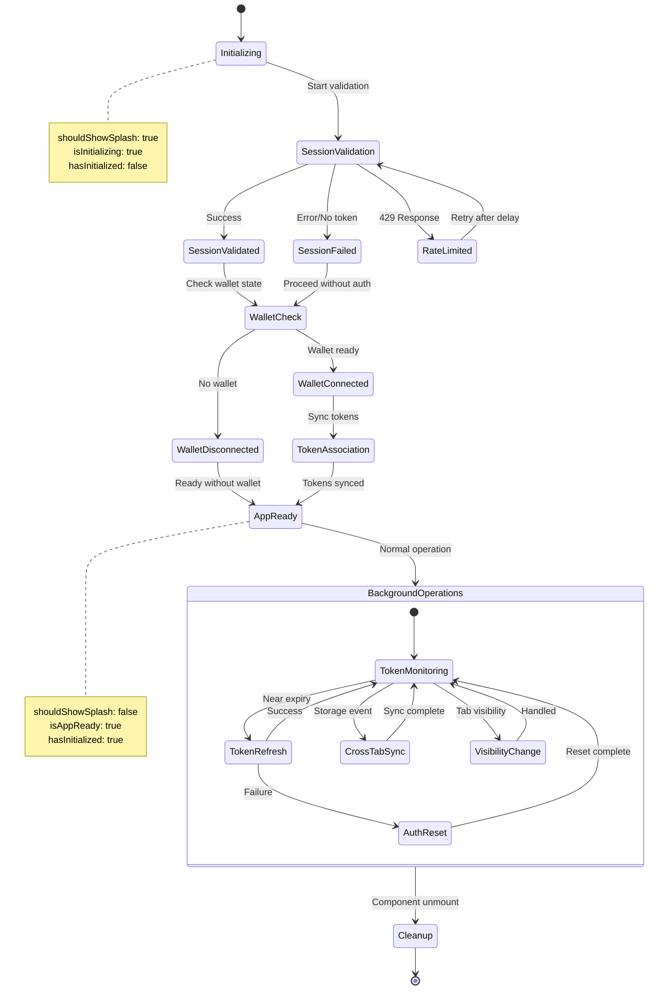
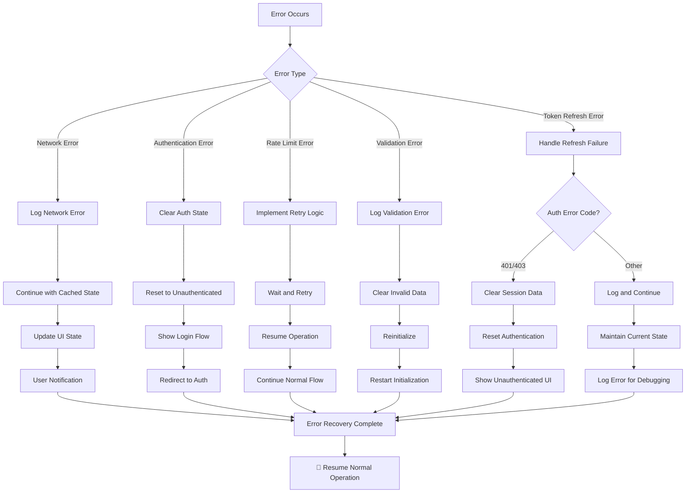

# 📋 Session Manager Hook - Comprehensive Usage Guide & Flow Charts

## 🏗️ **Architecture Overview**

The Session Manager Hook v3.0 is a modular, enterprise-grade solution for managing user sessions, wallet connections, and token authentication in React applications.

### **Core Architecture**

```
┌─────────────────────────────────────────────────────────────────┐
│                    useAppSessionManager                         │
│                     (Main Orchestrator)                        │
├─────────────────────────────────────────────────────────────────┤
│  ┌─────────────────┐  ┌─────────────────┐  ┌─────────────────┐  │
│  │  Token Manager  │  │  Wallet Sync    │  │ Session        │  │
│  │  - Token Expiry │  │  - Connection   │  │ Validator      │  │
│  │  - Auto Refresh │  │  - State Sync   │  │ - Auth Check   │  │
│  │  - Cross-tab    │  │  - Throttling   │  │ - Initialization│  │
│  └─────────────────┘  └─────────────────┘  └─────────────────┘  │
│  ┌─────────────────┐  ┌─────────────────┐  ┌─────────────────┐  │
│  │ Token           │  │ Cross-Tab       │  │ Tab Visibility  │  │
│  │ Association     │  │ Sync            │  │ Manager         │  │
│  │ - Contract Sync │  │ - Storage Event │  │ - Performance   │  │
│  │ - User Tokens   │  │ - Distributed   │  │ - Background    │  │
│  └─────────────────┘  └─────────────────┘  └─────────────────┘  │
└─────────────────────────────────────────────────────────────────┘
```

---

## 🔄 **Main Application Flow Chart**



---

## 🎯 **Session Initialization Flow**



---

## 🔐 **Token Management Flow**



---

## 🔗 **Wallet Synchronization Flow**



---

## 🖥️ **Cross-Tab Synchronization Flow**



---

## 👁️ **Tab Visibility Management Flow**



---

## 📊 **State Management Flow Chart**



---

## 🎨 **UI State Flow for Splash Screen**

```mermaid
graph TD
    A[Component Mount] --> B[useAppSessionManager()]
    B --> C{shouldShowSplash?}
    
    C -->|true| D[Show Splash Screen]
    C -->|false| E[Show Main App]
    
    D --> F{isInitializing?}
    F -->|true| G[Show: "Validating session..."]
    F -->|false| H{isRefreshing?}
    
    H -->|true| I[Show: "Refreshing tokens..."]
    H -->|false| J[Show: "Starting application..."]
    
    G --> K[Display Loading Spinner]
    I --> K
    J --> K
    
    K --> L{hasInitialized becomes true?}
    L -->|Yes| M{isUserAuthenticated?}
    L -->|No| N[Continue Showing Splash]
    
    M -->|true| O[shouldShowSplash: false]
    M -->|false| P[Show Wallet Connection UI]
    
    O --> Q[Hide Splash Screen]
    Q --> R[Show Main Application]
    
    P --> S{Wallet Connected?}
    S -->|Yes| O
    S -->|No| T[Continue Wallet UI]
    
    N --> F
    T --> S
    
    R --> U[Background Token Management]
    U --> V{Token Refresh Needed?}
    V -->|Yes| W[Show Subtle Refresh Indicator]
    V -->|No| X[Normal Operation]
    
    W --> Y[Background Refresh Complete]
    Y --> X
    X --> Z[🎉 Full App Experience]
```

---

## 🔧 **Error Handling Flow**



---

## 📱 **Usage Patterns & Examples**

### **Basic Implementation**
```typescript
const App = () => {
  const sessionManager = useAppSessionManager();

  if (sessionManager.shouldShowSplash) {
    return <SplashScreen />;
  }

  return <MainApp />;
};
```

### **Advanced Implementation with Progress**
```typescript
const App = () => {
  const sessionManager = useAppSessionManager();

  if (!sessionManager.isAppReady) {
    return (
      <LoadingScreen>
        <ProgressIndicator
          steps={[
            { label: 'Session', completed: sessionManager.hasInitialized },
            { label: 'Wallet', completed: sessionManager.isUserAuthenticated },
            { label: 'Ready', completed: sessionManager.isAppReady }
          ]}
        />
      </LoadingScreen>
    );
  }

  return (
    <div>
      <MainApp />
      {sessionManager.isRefreshing && <TokenRefreshIndicator />}
    </div>
  );
};
```

### **Granular State Control**
```typescript
const AppStateManager = () => {
  const {
    hasInitialized,
    isInitializing,
    isUserAuthenticated,
    isRefreshing,
    shouldShowSplash,
    isAppReady
  } = useAppSessionManager();

  // Custom loading logic based on specific needs
  if (isInitializing) return <SessionValidationScreen />;
  if (hasInitialized && !isUserAuthenticated) return <WalletConnectionScreen />;
  if (shouldShowSplash) return <SplashScreen />;
  
  return (
    <Router>
      <Routes>
        <Route path="/dashboard" element={
          isAppReady ? <Dashboard /> : <LoadingPage />
        } />
      </Routes>
      {isRefreshing && <BackgroundRefreshIndicator />}
    </Router>
  );
};
```

---

## 🎯 **Best Practices Summary**

### ✅ **DO:**
- Use `shouldShowSplash` for primary loading states
- Monitor `isAppReady` for full application readiness
- Show subtle indicators during `isRefreshing`
- Implement progressive loading with state flags
- Handle errors gracefully with fallback states

### ❌ **DON'T:**
- Create additional loading state management
- Block UI during background token operations
- Ignore cross-tab synchronization events
- Skip error handling for network failures
- Override the modular architecture

---

## 🔍 **Debugging Guide**

### **State Inspection**
```typescript
const sessionManager = useAppSessionManager();

console.log('Session Manager State:', {
  shouldShowSplash: sessionManager.shouldShowSplash,
  isAppReady: sessionManager.isAppReady,
  hasInitialized: sessionManager.hasInitialized,
  isInitializing: sessionManager.isInitializing,
  isRefreshing: sessionManager.isRefreshing,
  isUserAuthenticated: sessionManager.isUserAuthenticated
});
```

### **Development Logging**
The Session Manager provides detailed logging in development mode:
- `[useAppSessionManager]` - Main hook events
- `[TokenManager]` - Token operations
- `[WalletSync]` - Wallet state changes
- `[SessionValidator]` - Session validation
- `[CrossTabSync]` - Cross-tab events

---

This comprehensive guide covers all aspects of the Session Manager Hook with detailed flow charts for every major operation. Use this as your reference for implementation, debugging, and understanding the complete lifecycle of session management in your application.
