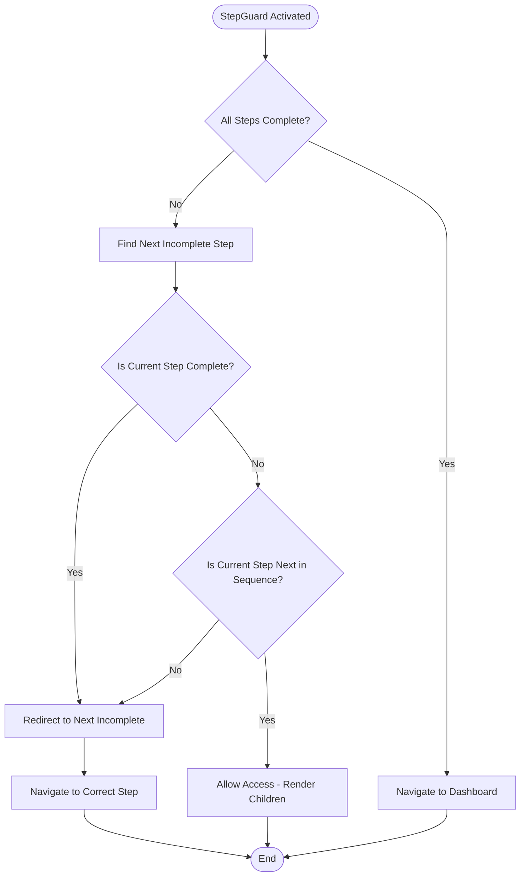

# StepGuard Component - Comprehensive Guide

## Overview

The `StepGuard` component is a crucial navigation controller that manages the authentication and onboarding flow in Hashbuzz application. It ensures users complete required steps in the correct order and automatically redirects them to the appropriate step based on their current progress.

## Purpose & Responsibilities

### 🎯 Primary Functions
1. **Sequential Flow Control**: Ensures users complete steps in the correct order
2. **Automatic Navigation**: Redirects users to the next incomplete step
3. **Step Skipping**: Allows completed steps to be bypassed automatically
4. **Progress Validation**: Prevents users from accessing steps they're not ready for
5. **Dashboard Routing**: Automatically redirects to dashboard when all steps are complete

### 🔐 Security Benefits
- Prevents unauthorized access to advanced steps
- Ensures all prerequisites are met before proceeding
- Maintains consistent user state across the application

## Architecture

### Component Structure
```typescript
interface StepGuardProps {
  step: OnboardingSteps;     // The step this guard is protecting
  children: React.ReactNode; // The component to render if access is allowed
}
```

### Dependencies
- **Redux Store**: Monitors authentication state via selectors
- **React Router**: Handles navigation between steps
- **OnboardingSteps Enum**: Defines available steps and their sequence

## Step Configuration

### Step Order (Sequential)
```typescript
const STEP_ORDER: OnboardingSteps[] = [
  OnboardingSteps.PairWallet,        // Step 1: Connect wallet
  OnboardingSteps.SignAuthentication, // Step 2: Authenticate user
  OnboardingSteps.ConnectXAccount,    // Step 3: Link X account
  OnboardingSteps.AssociateTokens,    // Step 4: Associate tokens
];
```

### Route Mapping
```typescript
const STEP_PATHS: Record<OnboardingSteps, string> = {
  [OnboardingSteps.PairWallet]: "/auth/pair-wallet",
  [OnboardingSteps.SignAuthentication]: "/auth/sign-authentication",
  [OnboardingSteps.ConnectXAccount]: "/auth/connect-x-account",
  [OnboardingSteps.AssociateTokens]: "/auth/associate-tokens",
};
```

## Redux State Integration

### State Selectors
The StepGuard monitors these Redux state flags:

```typescript
// Wallet pairing status
const walletIsPaired = useAppSelector(
  (s: RootState) => s.auth.userAuthAndOnBoardSteps.wallet.isPaired
);

// Authentication status
const authIsAuthenticated = useAppSelector(
  (s: RootState) => s.auth.userAuthAndOnBoardSteps.auth.isAuthenticated
);

// X account connection status
const xAccountIsConnected = useAppSelector(
  (s: RootState) => s.auth.userAuthAndOnBoardSteps.xAccount.isConnected
);

// Token association status
const tokensAreAllAssociated = useAppSelector(
  (s: RootState) => s.auth.userAuthAndOnBoardSteps.token.isAllAssociated
);
```

### State-to-Step Mapping
| Redux State | Corresponding Step | Completion Check |
|-------------|-------------------|------------------|
| `wallet.isPaired` | `PairWallet` | Wallet connected and verified |
| `auth.isAuthenticated` | `SignAuthentication` | User authenticated with backend |
| `xAccount.isConnected` | `ConnectXAccount` | X account linked |
| `token.isAllAssociated` | `AssociateTokens` | Required tokens associated |

## Navigation Logic

### Decision Flow


### Core Logic Functions

#### 1. Step Completion Check
```typescript
const isStepCompleted = (stepToCheck: OnboardingSteps): boolean => {
  switch (stepToCheck) {
    case OnboardingSteps.PairWallet:
      return walletIsPaired;
    case OnboardingSteps.SignAuthentication:
      return authIsAuthenticated;
    case OnboardingSteps.ConnectXAccount:
      return xAccountIsConnected;
    case OnboardingSteps.AssociateTokens:
      return tokensAreAllAssociated;
    default:
      return false;
  }
};
```

#### 2. Next Step Finder
```typescript
const getNextIncompleteStep = (): OnboardingSteps | null => {
  for (const stepInOrder of STEP_ORDER) {
    if (!isStepCompleted(stepInOrder)) {
      return stepInOrder;
    }
  }
  return null; // All steps completed
};
```

## Usage Examples

### Basic Implementation
```tsx
// In your route component
import StepGuard from '@/components/StepGuard';
import { OnboardingSteps } from '@/Ver2Designs/Pages/AuthAndOnboard/authStoreSlice';

const PairWalletPage = () => {
  return (
    <StepGuard step={OnboardingSteps.PairWallet}>
      <PairWalletContent />
    </StepGuard>
  );
};
```

### Route Configuration
```tsx
// In your router setup
const routes = [
  {
    path: "/auth/pair-wallet",
    element: (
      <StepGuard step={OnboardingSteps.PairWallet}>
        <PairWalletPage />
      </StepGuard>
    ),
  },
  {
    path: "/auth/sign-authentication",
    element: (
      <StepGuard step={OnboardingSteps.SignAuthentication}>
        <SignAuthenticationPage />
      </StepGuard>
    ),
  },
  // ... other routes
];
```

## User Journey Scenarios

### 🆕 New User Journey
1. **Visits `/auth/connect-x-account`** → Redirected to `/auth/pair-wallet` (first incomplete step)
2. **Completes wallet pairing** → Automatically redirected to `/auth/sign-authentication`
3. **Completes authentication** → Automatically redirected to `/auth/connect-x-account`
4. **Completes X account connection** → Automatically redirected to `/auth/associate-tokens`
5. **Completes token association** → Automatically redirected to `/dashboard`

### 🔄 Returning User Journey
1. **Has wallet + auth + X account** → Any auth route redirects to `/auth/associate-tokens`
2. **All steps complete** → Any auth route redirects to `/dashboard`

### ⏭️ Step Skipping
1. **User tries to access Step 3** → Redirected to Step 1 (if incomplete)
2. **User on Step 2 when Step 1 completes** → Automatically moves to Step 2
3. **Step 2 also completes** → Automatically moves to Step 3

## Performance Optimizations

### Selective Redux Subscriptions
```typescript
// ✅ Good: Subscribe to primitive values only
const walletIsPaired = useAppSelector(s => s.auth.userAuthAndOnBoardSteps.wallet.isPaired);

// ❌ Avoid: Subscribing to entire objects (causes unnecessary re-renders)
const wallet = useAppSelector(s => s.auth.userAuthAndOnBoardSteps.wallet);
```

### Dependency Array Optimization
```typescript
useEffect(() => {
  // Navigation logic here
}, [
  step,                    // Only re-run when step prop changes
  walletIsPaired,         // Or when completion status changes
  authIsAuthenticated,
  xAccountIsConnected,
  tokensAreAllAssociated,
  navigate,               // Navigation function (stable)
]);
```

## Integration with Token Refresh

The StepGuard works seamlessly with the token refresh system:

1. **Authentication Check**: If `auth.isAuthenticated` becomes `false` due to token expiry
2. **Automatic Refresh**: `TokenRefreshProvider` attempts token refresh
3. **State Update**: If refresh succeeds, `authenticated()` action updates Redux
4. **Guard Reaction**: StepGuard detects the state change and allows progress

## Error Handling

### Invalid Step Access
```typescript
// User tries to access a step they're not ready for
if (step !== nextIncompleteStep) {
  navigate(STEP_PATHS[nextIncompleteStep]);
  return;
}
```

### Malformed State
```typescript
// Fallback for unknown steps
default:
  return false; // Treat as incomplete
```

## Best Practices

### ✅ Do's
- **Wrap each auth page** with StepGuard
- **Use primitive selectors** to avoid unnecessary re-renders
- **Keep step order** clearly defined and documented
- **Test all navigation scenarios** (new user, returning user, step skipping)

### ❌ Don'ts
- **Don't bypass StepGuard** on auth routes
- **Don't modify step order** without updating all dependencies
- **Don't subscribe to complex objects** in Redux selectors
- **Don't hardcode routes** - use the `STEP_PATHS` mapping

## Testing Scenarios

### Unit Tests
```typescript
describe('StepGuard', () => {
  it('redirects to first incomplete step for new users', () => {
    // Test with all steps incomplete
  });
  
  it('allows access to current step when prerequisites are met', () => {
    // Test with previous steps complete
  });
  
  it('redirects to dashboard when all steps complete', () => {
    // Test with all flags true
  });
});
```

### Integration Tests
1. **Full user journey** - new user through all steps
2. **Returning user scenarios** - various completion states
3. **Direct URL access** - ensure proper redirects
4. **State changes** - verify reactions to Redux updates

## Troubleshooting

### Common Issues

#### User Stuck in Redirect Loop
**Cause**: Redux state not updating after step completion
**Solution**: Verify action dispatchers are called after successful operations

#### Wrong Step Access
**Cause**: Step order or paths misconfigured
**Solution**: Check `STEP_ORDER` and `STEP_PATHS` consistency

#### Performance Issues
**Cause**: Complex object selectors causing excessive re-renders
**Solution**: Use primitive selectors and React DevTools to identify re-render causes

## Future Enhancements

### Potential Improvements
1. **Step Dependencies**: More complex prerequisite logic
2. **Conditional Steps**: Skip certain steps based on user type
3. **Progress Persistence**: Save progress across sessions
4. **Analytics Integration**: Track step completion rates
5. **Dynamic Step Configuration**: Load step configuration from backend

The StepGuard component provides a robust, maintainable solution for managing complex authentication flows while ensuring security and user experience quality.
